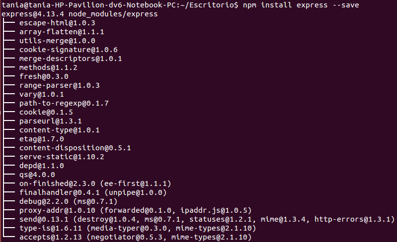

Tutorial NodeJS, Express, Atom, GitHub, Cloud9 y Markdown
======================================================

## Instalación de NodeJS en Ubuntu 14.04

Es un intérprete **Javascript** del lado del servidor que cambia la noción de cómo debería trabajar un servidor. Su meta es permitir a un programador construir aplicaciones altamente escalables y escribir código que maneje decenas de miles de conexiones simultáneas en una sola máquina física.

Para empezar a utilizarlo descargar el paquete de instalación para la plataforma Linux y a continuación ejecutar los siguientes comandos en una consola Linux:

Después de descomprimir el archivo que se descarga,


Abrimos la consola de **NodeJS** y comprobamos que se ha instalado correctamente.


Instalamos el framework **Express** con la consola de **NodeJS** y el siguiente comando:

**Comando**

> `npm install express --save`



## Instalación del editor de texto Atom

Usaremos **Atom** como editor de texto para el desarrollo de nuestros proyectos, para ello descargamos el instalador en la página oficial de atom, y lo abrimos con el Centro de software de Ubuntu. Una vez instalado se verá así:


Dado que vamos a utilizar el formato **Markdown** es bueno saber que en **Atom** podremos obtener una preview del contenido de nuestro fichero Markdown ya que incorpora el formato **GitHub Markdown** con el comando:

**Comando**

> * Markdown preview `ctrl+shift+m`
> * Markdown export to HTML `boton derecho sobre el preview > Save As HTML`


## Cloud 9

Es un IDE de desarrollo online, para su uso será necesario crear una cuenta en la página oficial o acceder con las credenciales de GitHub si ya se dispone de una cuenta. Una vez registrados podremos crear proyectos de varias tecnologías como puede ser NodeJS, HTML5, C++, Ruby On Rails, etc. Como ya tengo cuenta me saltaré este paso.


## Markdown

Markdown es un lenguaje de marcado ligero, lo vamos a utilizar en el editor de texto Atom ya que incorpora por defecto este formato y podremos obtener un live preview mientras vamos desarrollando además de poder exportarlo a HTML sin la necesidad de usar un conversor adicional.

Sintaxis:


Encabezados
```
# Encabezado H1
## Encabezado H2
### Encabezado H3
```
Tipografía
```
**Negrita**
*Cursiva*
> Citas
Parrafo separar por lineas en blanco
`Codigo`
```
Recursos
```

* [Links](https://example.com)
```
Listas
```
1. Lista 1
2. Lista 2

* Lista 1
* Lista 2
```

**Recursos:**

* [NodeJS](https://nodejs.org)
* [Express](http://expressjs.com)
* [Atom IDE](https://atom.io)
* [GitHub Desktop](https://desktop.github.com)
* [GitHub Pages](https://pages.github.com/)
* [Cloud 9 IDE](https://c9.io)
* [Markdown](http://daringfireball.net/projects/markdown/)
* [Resultado del Markdown HTML](http://tania77.github.io/tareas-iniciales-tania-dsi-1516/)
